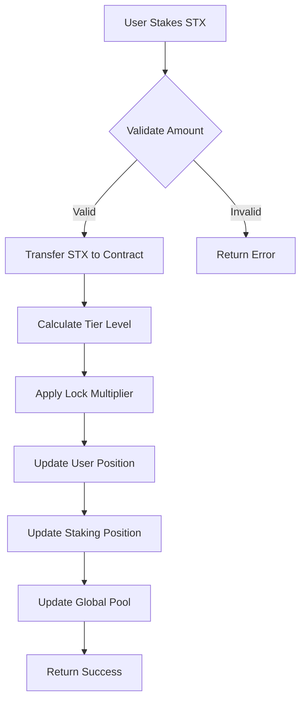
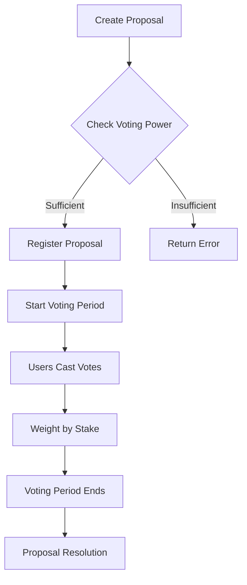
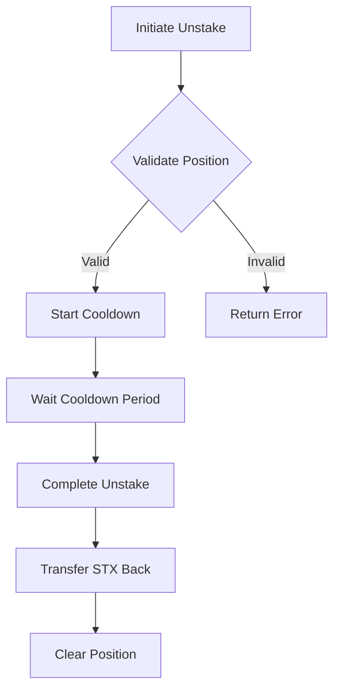

# Nexus Protocol

> **Bitcoin-Secured Liquid Staking & Governance Hub**

Nexus Protocol is a sophisticated liquid staking ecosystem built on Stacks that harnesses Bitcoin's security while providing flexible governance, multi-tier rewards, and seamless capital efficiency for DeFi participants.

## 🚀 Key Features

- **Liquid Staking**: Maintain full capital mobility while earning rewards
- **Multi-Tier Rewards**: Dynamic rewards that scale with commitment depth
- **Weighted Governance**: Time-weighted voting with quadratic mechanisms
- **Bitcoin Security**: Emergency safeguards anchored to Bitcoin's consensus
- **Capital Efficiency**: Cross-protocol yield optimization with risk management
- **Transparent Governance**: Community-driven parameter adjustment

## 🏗️ System Overview

Nexus Protocol transforms traditional staking by creating a three-tier ecosystem where users can stake STX tokens, earn compounding rewards, and participate in governance while maintaining liquidity. The protocol leverages Bitcoin's security model through Stacks' unique Proof-of-Transfer consensus.

### Core Components

```
┌─────────────────┐    ┌─────────────────┐    ┌─────────────────┐
│   Staking       │    │   Governance    │    │   Rewards       │
│   Engine        │────│   Module        │────│   Distribution  │
│                 │    │                 │    │                 │
└─────────────────┘    └─────────────────┘    └─────────────────┘
         │                       │                       │
         └───────────────────────┼───────────────────────┘
                                 │
                    ┌─────────────────┐
                    │   Emergency     │
                    │   Controls      │
                    │                 │
                    └─────────────────┘
```

## 🏛️ Contract Architecture

### Smart Contract Structure

```
Nexus Protocol Contract
├── Token Definitions
│   └── ANALYTICS-TOKEN (Fungible Token)
├── Core Constants
│   ├── Contract Owner
│   └── Error Codes (1000-1007)
├── Protocol Variables
│   ├── State Management (paused, emergency)
│   ├── Economic Parameters (rates, minimums)
│   └── Operational Settings (cooldowns, counts)
├── Data Structures
│   ├── Proposals (Governance)
│   ├── UserPositions (Portfolio)
│   ├── StakingPositions (Stakes)
│   └── TierLevels (Configurations)
└── Functions
    ├── Private (Internal Logic)
    ├── Public (User Interface)
    └── Read-Only (Query Interface)
```

### Tier Architecture

| Tier | Name | Minimum Stake | Reward Multiplier | Features |
|------|------|---------------|-------------------|----------|
| 1 | Silver | 1M STX | 1.0x | Basic staking |
| 2 | Gold | 5M STX | 1.5x | Enhanced rewards + governance |
| 3 | Diamond | 10M STX | 2.0x | Premium features + priority access |

## 🔄 Data Flow

### Staking Flow



### Governance Flow



### Unstaking Flow



## 🛠️ Technical Specifications

### Economic Parameters

- **Base Reward Rate**: 5% APY (configurable)
- **Minimum Stake**: 1,000,000 µSTX
- **Cooldown Period**: 1,440 blocks (~24 hours)
- **Lock Periods**: 0, 30, 60 days
- **Time Multipliers**: 1.0x, 1.25x, 1.5x

### Security Features

- **Emergency Pause**: Owner can halt operations
- **Cooldown Protection**: Prevents flash unstaking
- **Minimum Thresholds**: Prevents dust positions
- **Voting Power Gates**: Requires stake for governance participation

## 📊 State Management

### User Position Tracking

```clarity
{
    total-collateral: uint,
    total-debt: uint,
    health-factor: uint,
    last-updated: uint,
    stx-staked: uint,
    analytics-tokens: uint,
    voting-power: uint,
    tier-level: uint,
    rewards-multiplier: uint
}
```

### Staking Position Management

```clarity
{
    amount: uint,
    start-block: uint,
    last-claim: uint,
    lock-period: uint,
    cooldown-start: (optional uint),
    accumulated-rewards: uint
}
```

## 🔧 Deployment & Integration

### Prerequisites

- Stacks blockchain testnet/mainnet access
- Clarity smart contract development environment
- Minimum STX balance for contract deployment

### Contract Initialization

```clarity
;; Initialize the protocol with tier configurations
(contract-call? .nexus-protocol initialize-contract)
```

### Integration Examples

```clarity
;; Stake STX with 1-month lock
(contract-call? .nexus-protocol stake-stx u5000000 u4320)

;; Create governance proposal
(contract-call? .nexus-protocol create-proposal "Increase base reward rate to 6%" u2880)

;; Vote on proposal
(contract-call? .nexus-protocol vote-on-proposal u1 true)
```

## 🛡️ Security Considerations

### Protocol Security

- **Bitcoin Anchoring**: Leverages Bitcoin's security through Stacks PoX
- **Time-Lock Protections**: Prevents immediate unstaking
- **Emergency Controls**: Owner can pause in critical situations
- **Validation Layers**: Multiple checks for all operations

### Economic Security

- **Minimum Stakes**: Prevents Sybil attacks
- **Graduated Rewards**: Incentivizes long-term participation
- **Cooldown Periods**: Prevents flash loan attacks
- **Voting Power Correlation**: Aligns governance with economic stake

## 📈 Governance Model

### Proposal Lifecycle

1. **Creation**: Requires minimum voting power
2. **Voting Period**: Time-bound democratic process
3. **Execution**: Automatic or manual execution
4. **Monitoring**: On-chain transparency

### Voting Mechanics

- **Weighted Voting**: Based on staked amount and tier
- **Quadratic Elements**: Reduces whale dominance
- **Time Decay**: Recent stakes have higher weight
- **Participation Incentives**: Governance rewards for active voters

## 🔮 Future Enhancements

- **Cross-Chain Integration**: Bridge to other Bitcoin L2s
- **Advanced Yield Strategies**: Automated DeFi integrations
- **NFT Rewards**: Tier-based achievement system
- **DAO Treasury**: Community-managed protocol treasury
- **Liquid Staking Derivatives**: Tradeable staking positions

## 📝 License

This project is licensed under the MIT License - see the LICENSE file for details.

## 🤝 Contributing

Contributions are welcome! Please read our contributing guidelines and submit pull requests for any improvements.
